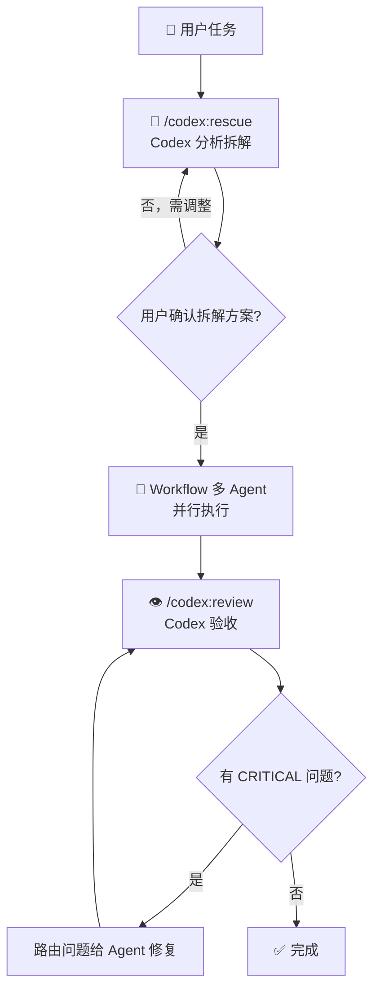

# CodexCC

[](LICENSE)
[](https://claude.ai/code)
[](https://github.com/openai/codex-plugin-cc)

**Codex 当脑，Claude Code 当手。** 一个 Claude Code Skill，实现「Codex 拆解 → 多 Agent 并行执行 → Codex 验收」三步闭环。

## 前置条件

**必须先安装 [Codex Plugin for Claude Code](https://github.com/openai/codex-plugin-cc)：**

```bash
# 在 Claude Code 中运行
/plugin marketplace add openai/codex-plugin-cc
/plugin install codex@openai-codex
/reload-plugins
/codex:setup
```

还需要：
- ChatGPT 订阅（含 Free）或 OpenAI API key
- Node.js ≥ 18.18
- Codex CLI：`npm install -g @openai/codex`

## 安装

```bash
# 克隆到 Claude Code skills 目录
git clone https://github.com/hashiruu/codexcc.git ~/.claude/skills/codexcc
```

重启 Claude Code 会话后生效。

## 使用

```
codexcc: 重构 user-auth 模块，支持 OAuth2 登录
codexcc: 排查 CI 偶发超时的根因
codexcc: 给项目加完整的错误处理和日志系统
```

## 工作流



## 守则

| 规则 | 原因 |
|------|------|
| 必须先让 Codex 拆任务 | gpt-5.4 深度推理可能强于当前模型 |
| 拆解结果用户确认后再执行 | Codex 理解可能有偏差 |
| 完成后必须 Codex review | 多 agent 并行改动容易出冲突 |
| 简单任务别用 | 单文件小改不值走三轮 overhead |

## License

Apache-2.0
